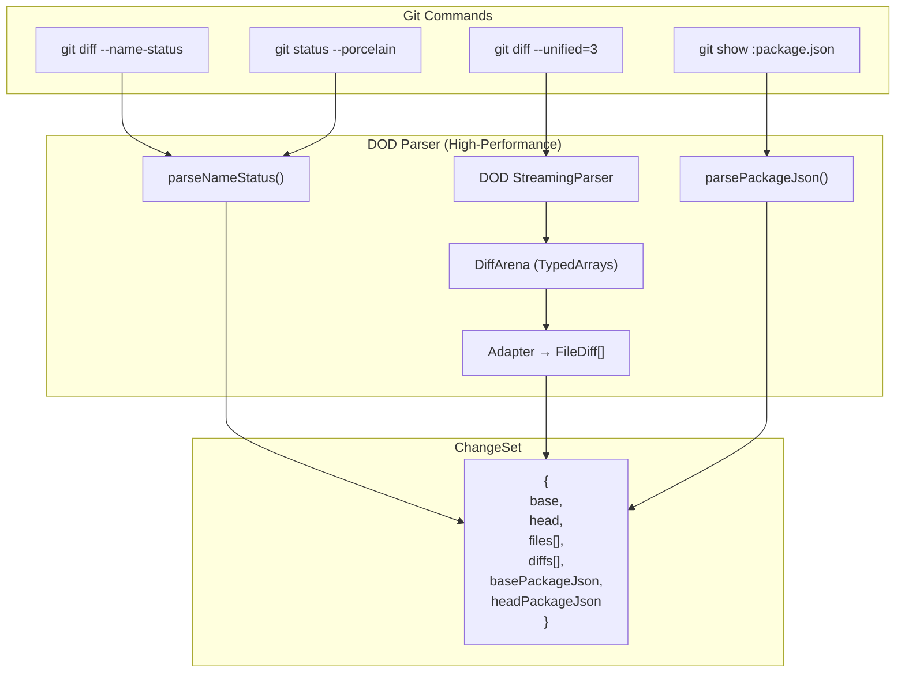
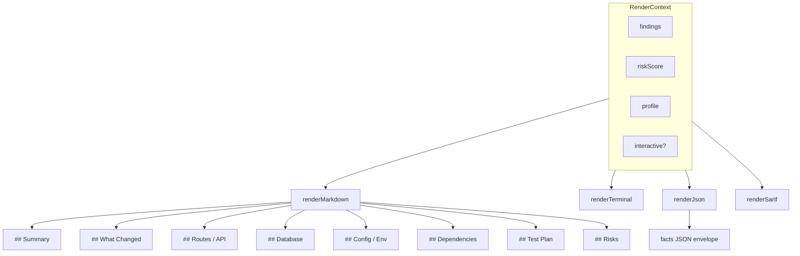
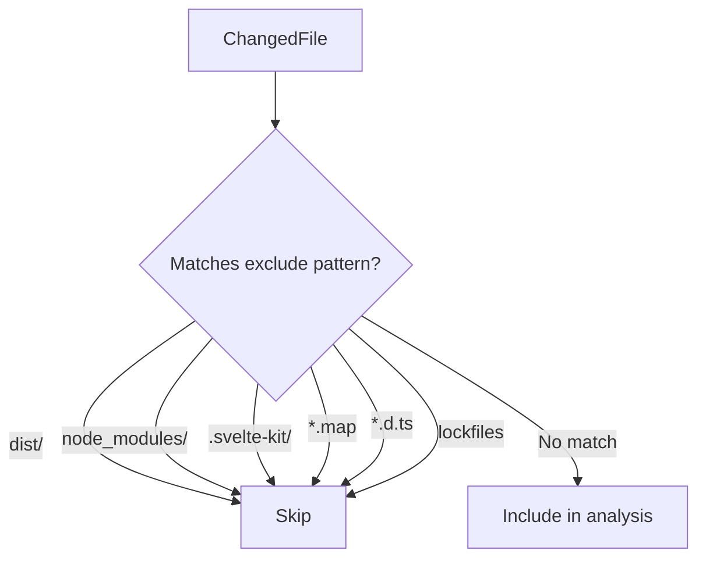

# Data Flow

## ChangeSet Construction



### DOD Parser Architecture

The diff parsing uses a Data-Oriented Design approach for optimal performance:

1. **DiffScanner**: Zero-copy byte-level scanner (no string allocation)
2. **DiffArena**: TypedArray storage with Struct of Arrays layout
   - **Indexed hunk access**: Each hunk stores `hunkFirstLineIndex` and `hunkLineCount`, enabling O(1) range lookup for its lines instead of scanning all lines in the arena
   - File → hunk and hunk → line relationships are both range-indexed
3. **StringInternPool**: FNV-1a hash-based string deduplication
4. **Lazy Decoding**: Strings decoded only when accessed; context lines are never decoded during hunk materialization
5. **Zero-copy status detection**: File status (add/delete/rename) determined by direct byte comparison, avoiding TextDecoder allocations

## Analyzer Pipeline

```mermaid
flowchart LR
    CS[ChangeSet] --> Runner[runAnalyzersInParallel]

    Runner --> fileSummary["file-summary"]
    Runner --> fileCategory["file-category"]
    Runner --> impact["impact"]
    Runner --> routes["route analyzers"]
    Runner --> deps["dependencies/lockfiles/package-exports"]
    Runner --> config["typescript/tailwind/vite/config"]
    Runner --> infra["infra/ci/sql-risk/security"]
    Runner --> tests["test analyzers"]

    fileSummary --> F[Finding[]]
    fileCategory --> F
    impact --> F
    routes --> F
    deps --> F
    config --> F
    infra --> F
    tests --> F
```

## Risk Score Computation

### Facts Risk Score (Summary)

The `facts` command uses a fast heuristic score used for summaries and highlights.
This is computed in `src/render/risk-score.ts` and produces `low`, `medium`, or `high`.

```mermaid
flowchart TD
    Findings[Finding[]] --> FactsScore["computeRiskScore()"]
    FactsScore --> FactsLevel["low / medium / high"]
```

### Risk Report (Flags and Five-Level Scale)

`risk-report` derives flags from findings, then computes a weighted score
with five levels: `low`, `moderate`, `elevated`, `high`, `critical`.

```mermaid
flowchart TD
    Findings2[Finding[]] --> Flags[findingsToFlags]
    Flags --> CategoryScores[categoryScores]
    CategoryScores --> OverallScore["riskScore (0-100)"]
    OverallScore --> RiskLevel["low/moderate/elevated/high/critical"]
```

## Render Flow



## File Filtering



