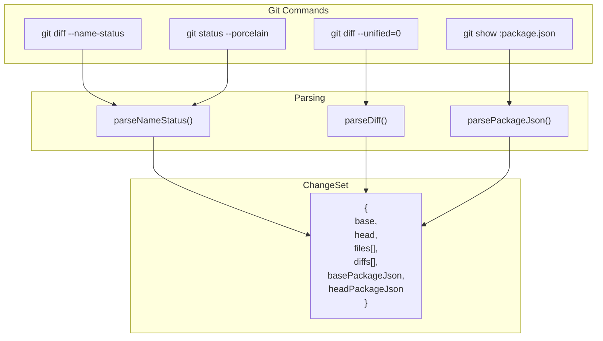
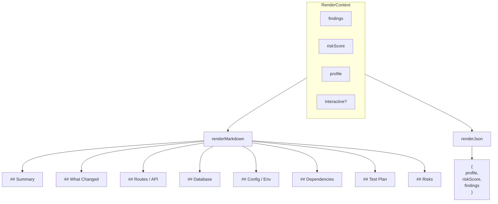
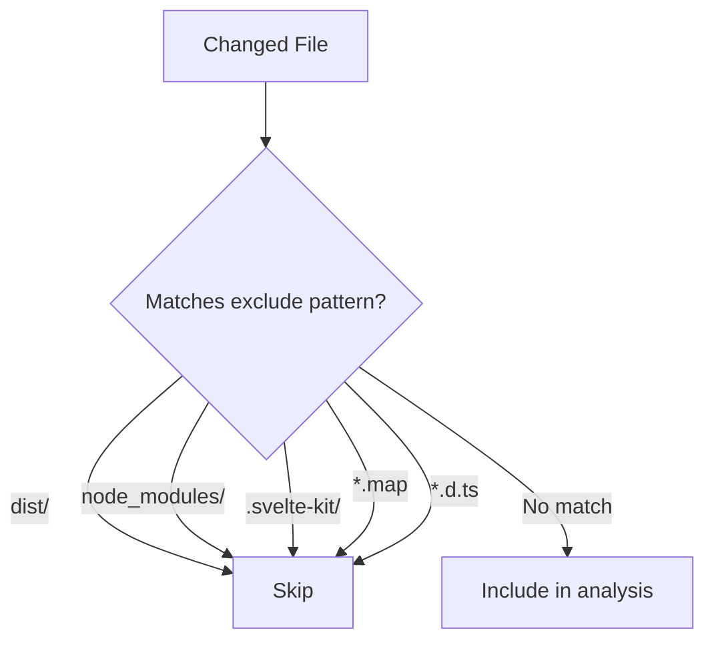

# Data Flow

## ChangeSet Construction



## Analyzer Pipeline

```mermaid
flowchart LR
    CS[ChangeSet] --> A1 & A2 & A3 & A4 & A5 & A6 & A7 & A8 & A9

    A1[file-summary] --> F[Finding[]]
    A2[file-category] --> F
    A3[route-detector] --> F
    A4[supabase] --> F
    A5[env-var] --> F
    A6[cloudflare] --> F
    A7[vitest] --> F
    A8[dependencies] --> F
    A9[security-files] --> F
```

## Risk Score Computation

```mermaid
flowchart TD
    F[Finding[]] --> RS[computeRiskScore]

    RS --> |risk-flag high| P40["+40 points"]
    RS --> |risk-flag medium| P20["+20 points"]
    RS --> |db-migration high| P30["+30 points"]
    RS --> |route deleted| P10["+10 points"]
    RS --> |dep major bump| P15["+15 points"]
    RS --> |security-file| P15b["+15 points"]
    RS --> |docs only| M15["-15 points"]
    RS --> |tests only| M10["-10 points"]

    P40 & P20 & P30 & P10 & P15 & P15b & M15 & M10 --> SUM[Sum & Cap 0-100]

    SUM --> |0-19| LOW[LOW 🟢]
    SUM --> |20-49| MED[MEDIUM 🟡]
    SUM --> |50-100| HIGH[HIGH 🔴]
```

## Render Flow



## File Filtering



