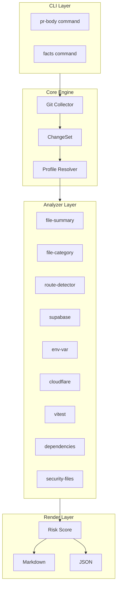
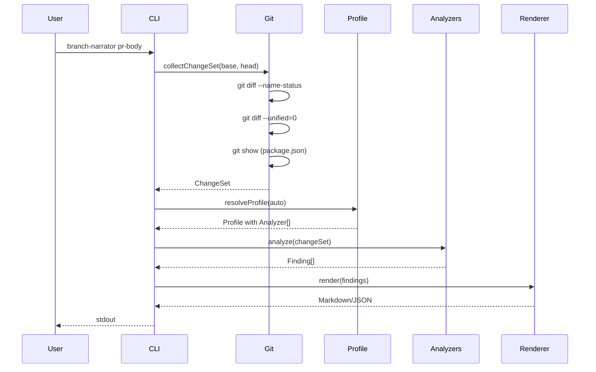

# Architecture Overview

## System Design

## Data Flow

## Design Principles

### 1. Heuristics-Only

No AI/LLM means:
- **Deterministic** - Same input always produces same output
- **Fast** - No network latency
- **Private** - Code never leaves the machine
- **Reliable** - No API dependencies

### 2. Profile-Based Architecture

Different frameworks need different analysis:
- SvelteKit has routes in `src/routes/`
- Next.js has routes in `pages/` or `app/`
- Each profile includes relevant analyzers

### 3. Evidence-Based Output

Never invent "why":
- Report what changed, not why
- Cite files as evidence
- Let humans provide context via `--interactive`

### 4. Extensible

Easy to add:
- New analyzers (one file each)
- New profiles (compose analyzers)
- New output formats (renderers)

