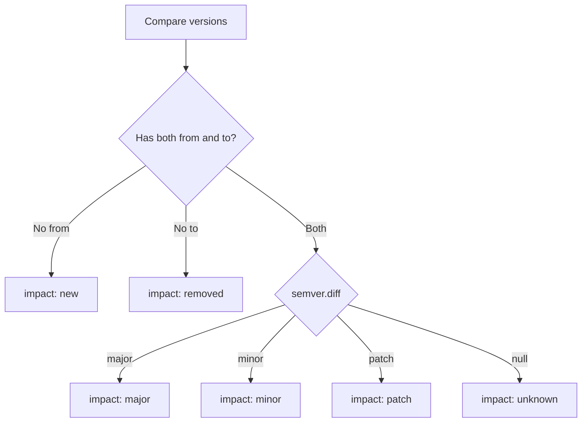

# Dependencies Analyzer

**File:** `src/analyzers/dependencies.ts`
**Finding Types:** `dependency-change`, `risk-flag`

## Purpose

Analyzes package.json changes to detect dependency additions, removals, and version bumps.

## Finding Type

```typescript
interface DependencyChangeFinding {
  type: "dependency-change";
  name: string;
  section: "dependencies" | "devDependencies";
  from?: string;
  to?: string;
  impact?: "major" | "minor" | "patch" | "new" | "removed" | "unknown";
  riskCategory?: "auth" | "database" | "native" | "payment";
}
```

## Impact Detection



## Risky Package Categories

### Auth Packages

```
passport, jsonwebtoken, bcrypt, bcryptjs, oauth, auth0,
@auth0/auth0-spa-js, clerk, @clerk/clerk-sdk-node, next-auth,
@auth/core, @auth/sveltekit, lucia, arctic, oslo, jose
```

### Database Packages

```
prisma, @prisma/client, drizzle-orm, typeorm, sequelize,
knex, mongoose, pg, mysql, mysql2, sqlite3, better-sqlite3,
mongodb, redis, ioredis, kysely
```

### Native Packages

```
sharp, canvas, node-gyp, node-pre-gyp, node-addon-api,
nan, ffi-napi, bcrypt, argon2, sodium-native
```

### Payment Packages

```
stripe, @stripe/stripe-js, paypal-rest-sdk, braintree,
square, @square/web-sdk, razorpay, mollie-api-node
```

## Example Output

```json
{
  "type": "dependency-change",
  "name": "stripe",
  "section": "dependencies",
  "to": "^12.0.0",
  "impact": "new",
  "riskCategory": "payment"
}
```

## Risk Flags

### Critical Package Major Bump

```json
{
  "type": "risk-flag",
  "risk": "high",
  "evidence": "Major version bump: @sveltejs/kit ^1.0.0 → ^2.0.0"
}
```

Critical packages: `@sveltejs/kit`, `svelte`, `vite`

### New Risky Package

```json
{
  "type": "risk-flag",
  "risk": "medium",
  "evidence": "New Payment Processing package: stripe"
}
```

## Usage in Markdown

```markdown
## Dependencies

### Production

| Package | From | To | Impact |
|---------|------|-----|--------|
| `@sveltejs/kit` | ^1.0.0 | ^2.0.0 | major |
| `stripe` | - | ^12.0.0 | new |

### Dev Dependencies

| Package | From | To | Impact |
|---------|------|-----|--------|
| `vitest` | ^0.28.0 | ^1.0.0 | major |
```

## Risk Scoring

| Event | Points |
|-------|--------|
| Major version bump | +15 |
| Minor version bump | +5 |
| New risky package | +10 |
| Critical package major bump | +40 (via risk-flag) |

