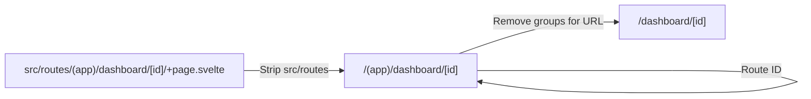

# Route Detector Analyzer

**File:** `src/analyzers/route-detector.ts`
**Finding Type:** `route-change`
**Profile:** SvelteKit only

## Purpose

Detects SvelteKit route changes including pages, layouts, and endpoints.

## Finding Type

```typescript
type RouteType = "page" | "layout" | "endpoint" | "error" | "unknown";

interface RouteChangeFinding {
  type: "route-change";
  routeId: string;         // e.g., "/dashboard", "/api/users"
  file: string;            // Full file path
  change: FileStatus;      // "added" | "modified" | "deleted"
  routeType: RouteType;
  methods?: string[];      // For endpoints: ["GET", "POST"]
}
```

## Route File Detection

| File Pattern | Route Type |
|-------------|------------|
| `+page.svelte`, `+page.ts`, `+page.server.ts` | `page` |
| `+layout.svelte`, `+layout.ts`, `+layout.server.ts` | `layout` |
| `+server.ts` | `endpoint` |
| `+error.svelte` | `error` |

## Route ID Generation



## HTTP Method Detection

For `+server.ts` files, scans diff additions for:

```typescript
export const GET = ...
export const POST = ...
export const PUT = ...
export const PATCH = ...
export const DELETE = ...
```

## Example Output

```json
{
  "type": "route-change",
  "routeId": "/api/users",
  "file": "src/routes/api/users/+server.ts",
  "change": "added",
  "routeType": "endpoint",
  "methods": ["GET", "POST"]
}
```

## Route Groups

SvelteKit route groups like `(app)` are:
- **Preserved** in `routeId` for accuracy
- **Removed** when displaying URL paths

```typescript
// Route ID: "/(app)/dashboard"
// URL Path: "/dashboard"
routeIdToUrlPath("/(app)/dashboard") // → "/dashboard"
```

## Parameters

Parameter notation is preserved:
- `[slug]` - Required param
- `[[id]]` - Optional param
- `[...rest]` - Rest param

## Usage in Markdown

```markdown
## Routes / API

| Route | Type | Change | Methods |
|-------|------|--------|---------|
| `/api/users` | endpoint | added | GET, POST |
| `/dashboard` | page | added | - |
```

