# Supabase Analyzer

**File:** `src/analyzers/supabase.ts`
**Finding Types:** `db-migration`, `risk-flag`

## Purpose

Scans Supabase migrations for destructive SQL patterns and assesses risk.

## Finding Types

```typescript
type MigrationRisk = "high" | "medium" | "low";

interface DbMigrationFinding {
  type: "db-migration";
  tool: "supabase";
  files: string[];
  risk: MigrationRisk;
  reasons: string[];
}
```

## Migration Detection

Files matching: `supabase/migrations/**/*.sql`

## Risk Levels

```mermaid
flowchart TD
    M[Migration Changed] --> D{Destructive patterns?}
    D -->|Yes| HIGH[🔴 HIGH]
    D -->|No| SAFE{Only migrations?}
    SAFE -->|Yes| MED[🟡 MEDIUM]
    SAFE -->|No| SEED{Only seeds/config?}
    SEED -->|Yes| LOW[🟢 LOW]
```



| Risk | Triggers |
|------|----------|
| **High** | Destructive SQL patterns detected |
| **Medium** | Migrations changed, no destructive patterns |
| **Low** | Only seed/config files changed |

## Destructive Patterns

| Pattern | Example |
|---------|---------|
| `DROP TABLE` | `DROP TABLE users;` |
| `DROP COLUMN` | `ALTER TABLE users DROP COLUMN email;` |
| `TRUNCATE` | `TRUNCATE TABLE sessions;` |
| `ALTER ... TYPE` | `ALTER TABLE products ALTER COLUMN price TYPE numeric;` |
| `DELETE` without `WHERE` | `DELETE FROM sessions;` |

## Example Output

```json
{
  "type": "db-migration",
  "tool": "supabase",
  "files": [
    "supabase/migrations/20240101_drop_legacy.sql"
  ],
  "risk": "high",
  "reasons": [
    "DROP TABLE detected in 20240101_drop_legacy.sql",
    "DELETE without WHERE detected"
  ]
}
```

## Risk Flag

High-risk migrations also emit a `risk-flag`:

```json
{
  "type": "risk-flag",
  "risk": "high",
  "evidence": "High-risk database migration: DROP TABLE detected"
}
```

## Usage in Markdown

```markdown
## Database (Supabase)

**Risk Level:** 🔴 HIGH

**Files:**
- `supabase/migrations/20240101_drop_legacy.sql`

**Detected patterns:**
- DROP TABLE detected
- DELETE without WHERE detected
```

## Seed and Config Files

These are detected but assigned lower risk:

| Pattern | Type |
|---------|------|
| `supabase/seed.sql` | Seed |
| `supabase/config.toml` | Config |
| `**/seed*.sql` | Seed |

