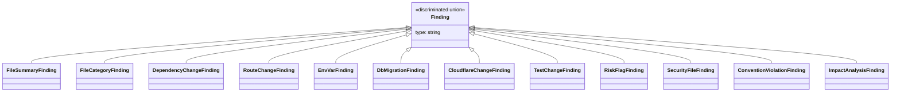

# Finding Types

All findings use a discriminated union pattern with `type` as the discriminator.

## Finding Union

```typescript
type Finding =
  | FileSummaryFinding
  | FileCategoryFinding
  | DependencyChangeFinding
  | RouteChangeFinding
  | EnvVarFinding
  | DbMigrationFinding
  | CloudflareChangeFinding
  | TestChangeFinding
  | RiskFlagFinding
  | SecurityFileFinding
  | ConventionViolationFinding
  | ImpactAnalysisFinding;
```

## Class Diagram



---

## FileSummaryFinding

```typescript
interface FileSummaryFinding {
  type: "file-summary";
  added: string[];
  modified: string[];
  deleted: string[];
  renamed: Array<{ from: string; to: string }>;
}
```

---

## FileCategoryFinding

```typescript
type FileCategory =
  | "product"
  | "tests"
  | "ci"
  | "infra"
  | "database"
  | "docs"
  | "dependencies"
  | "config"
  | "other";

interface FileCategoryFinding {
  type: "file-category";
  categories: Record<FileCategory, string[]>;
  summary: Array<{
    category: FileCategory;
    count: number;
  }>;
}
```

### Database Category Patterns

Files matching these patterns are categorized as `database`:
- `supabase/migrations/*` - Supabase migrations
- `supabase/seed*` - Supabase seed files
- `prisma/migrations/*` - Prisma migrations
- `prisma/schema.prisma` - Prisma schema
- `drizzle/migrations/*` - Drizzle migrations
- `drizzle.config*` - Drizzle config
- `migrations/` or `*/migrations/` - Generic migration directories
- `*.sql` - SQL files

---

## DependencyChangeFinding

```typescript
interface DependencyChangeFinding {
  type: "dependency-change";
  name: string;
  section: "dependencies" | "devDependencies";
  from?: string;
  to?: string;
  impact?: "major" | "minor" | "patch" | "new" | "removed" | "unknown";
  riskCategory?: "auth" | "database" | "native" | "payment";
}
```

---

## RouteChangeFinding

```typescript
type RouteType = "page" | "layout" | "endpoint" | "error" | "unknown";

interface RouteChangeFinding {
  type: "route-change";
  routeId: string;
  file: string;
  change: FileStatus;
  routeType: RouteType;
  methods?: string[];
}
```

---

## EnvVarFinding

```typescript
type EnvVarChange = "added" | "touched";

interface EnvVarFinding {
  type: "env-var";
  name: string;
  change: EnvVarChange;
  evidenceFiles: string[];
}
```

---

## DbMigrationFinding

```typescript
type MigrationRisk = "high" | "medium" | "low";

interface DbMigrationFinding {
  type: "db-migration";
  tool: "supabase";
  files: string[];
  risk: MigrationRisk;
  reasons: string[];
}
```

---

## CloudflareChangeFinding

```typescript
type CloudflareArea = "wrangler" | "pages" | "workers" | "ci";

interface CloudflareChangeFinding {
  type: "cloudflare-change";
  area: CloudflareArea;
  files: string[];
}
```

---

## TestChangeFinding

```typescript
interface TestChangeFinding {
  type: "test-change";
  framework: "vitest";
  files: string[];
}
```

---

## RiskFlagFinding

```typescript
type RiskLevel = "high" | "medium" | "low";

interface RiskFlagFinding {
  type: "risk-flag";
  risk: RiskLevel;
  evidence: string;
}
```

---

## SecurityFileFinding

```typescript
type SecurityFileReason =
  | "auth-path"
  | "session-path"
  | "permission-path"
  | "middleware"
  | "guard"
  | "policy";

interface SecurityFileFinding {
  type: "security-file";
  files: string[];
  reasons: SecurityFileReason[];
}
```

---

## ConventionViolationFinding

```typescript
interface ConventionViolationFinding {
  type: "convention-violation";
  message: string;
  files: string[];
}
```

---

## ImpactAnalysisFinding

```typescript
interface ImpactAnalysisFinding {
  type: "impact-analysis";
  sourceFile: string;
  affectedFiles: string[];
  importedSymbols?: string[]; // e.g. ["User", "login"]
  usageContext?: string; // e.g. "import { User } from './user'"
  isTestFile?: boolean; // true if all affected files are tests
  blastRadius: "low" | "medium" | "high";
}
```

---

## JSON Example

```json
{
  "findings": [
    {
      "type": "file-summary",
      "added": ["src/routes/login/+page.svelte"],
      "modified": ["package.json"],
      "deleted": [],
      "renamed": []
    },
    {
      "type": "route-change",
      "routeId": "/login",
      "file": "src/routes/login/+page.svelte",
      "change": "added",
      "routeType": "page"
    },
    {
      "type": "dependency-change",
      "name": "lucia",
      "section": "dependencies",
      "to": "^3.0.0",
      "impact": "new",
      "riskCategory": "auth"
    },
    {
      "type": "risk-flag",
      "risk": "medium",
      "evidence": "New Authentication/Security package: lucia"
    }
  ]
}
```

