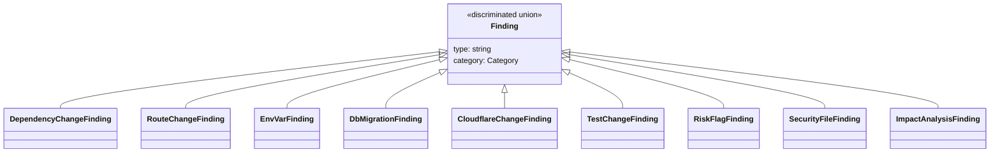

# Finding Types

All findings use a discriminated union pattern with `type` as the discriminator.

## Schema Version 2.0 Changes

In schema version 2.0, findings are split into two categories:

1. **Domain Findings** - Appear in the `findings` array. These represent specific changes in a domain area (routes, database, tests, etc.)

2. **Meta Findings** - Appear in the `changeset` structure. These describe the changeset as a whole, not domain-specific changes:
   - `file-summary` → `changeset.files`
   - `file-category` → `changeset.byCategory` and `changeset.categorySummary`
   - `large-diff` → `changeset.warnings`
   - `lockfile-mismatch` → `changeset.warnings`

## Finding Union (All Findings)

```typescript
type Finding =
  | FileSummaryFinding
  | FileCategoryFinding
  | DependencyChangeFinding
  | RouteChangeFinding
  | EnvVarFinding
  | DbMigrationFinding
  | CloudflareChangeFinding
  | TestChangeFinding
  | RiskFlagFinding
  | ImpactAnalysisFinding
  | SecurityFileFinding
  | ConventionViolationFinding
  | CIWorkflowFinding
  | SQLRiskFinding
  | InfraChangeFinding
  | APIContractChangeFinding
  | LargeDiffFinding
  | LockfileFinding
  | StencilComponentChangeFinding
  | StencilPropChangeFinding
  | StencilEventChangeFinding
  | StencilMethodChangeFinding
  | StencilSlotChangeFinding
  | GraphQLChangeFinding
  | TypeScriptConfigFinding
  | TailwindConfigFinding
  | ViteConfigFinding
  | MonorepoConfigFinding
  | PackageExportsFinding
  | PythonMigrationFinding
  | PythonConfigFinding
  | AngularComponentChangeFinding
  | CypressConfigFinding
  | I18nChangeFinding
  | WebSocketChangeFinding
  | CSSChangeFinding;
```

## Class Diagram

This diagram is illustrative and not exhaustive.



---

## Meta Findings (in changeset structure)

These findings are no longer in the `findings` array. Their data is in `changeset`:

### FileSummaryFinding → `changeset.files`

```typescript
// Old (in findings array):
interface FileSummaryFinding {
  type: "file-summary";
  added: string[];
  modified: string[];
  deleted: string[];
  renamed: Array<{ from: string; to: string }>;
}

// New (in changeset):
changeset.files = {
  added: string[];
  modified: string[];
  deleted: string[];
  renamed: Array<{ from: string; to: string }>;
}
```

### FileCategoryFinding → `changeset.byCategory`

```typescript
// Old (in findings array):
interface FileCategoryFinding {
  type: "file-category";
  categories: Record<FileCategory, string[]>;
  summary: Array<{ category: FileCategory; count: number }>;
}

// New (in changeset):
changeset.byCategory = Record<FileCategory, string[]>;
changeset.categorySummary = Array<{ category: FileCategory; count: number }>;
```

### LargeDiffFinding → `changeset.warnings`

```typescript
// Old (in findings array):
interface LargeDiffFinding {
  type: "large-diff";
  filesChanged: number;
  linesChanged: number;
}

// New (in changeset.warnings):
{ type: "large-diff", filesChanged: number, linesChanged: number }
```

### LockfileFinding → `changeset.warnings`

```typescript
// Old (in findings array):
interface LockfileFinding {
  type: "lockfile-mismatch";
  manifestChanged: boolean;
  lockfileChanged: boolean;
}

// New (in changeset.warnings):
{ type: "lockfile-mismatch", manifestChanged: boolean, lockfileChanged: boolean }
```

---

## Domain Findings

These findings appear in the `findings` array and have meaningful `category` values.

## FileSummaryFinding

```typescript
interface FileSummaryFinding {
  type: "file-summary";
  added: string[];
  modified: string[];
  deleted: string[];
  renamed: Array<{ from: string; to: string }>;
}
```

---

## FileCategoryFinding

```typescript
type FileCategory =
  | "product"
  | "tests"
  | "ci"
  | "infra"
  | "database"
  | "docs"
  | "dependencies"
  | "config"
  | "artifacts"
  | "other";

interface FileCategoryFinding {
  type: "file-category";
  categories: Record<FileCategory, string[]>;
  summary: Array<{
    category: FileCategory;
    count: number;
  }>;
}
```

### Database Category Patterns

Files matching these patterns are categorized as `database`:
- `supabase/migrations/*` - Supabase migrations
- `supabase/seed*` - Supabase seed files
- `prisma/migrations/*` - Prisma migrations
- `prisma/schema.prisma` - Prisma schema
- `drizzle/migrations/*` - Drizzle migrations
- `drizzle.config*` - Drizzle config
- `migrations/` or `*/migrations/` - Generic migration directories
- `*.sql` - SQL files

---

## DependencyChangeFinding

```typescript
interface DependencyChangeFinding {
  type: "dependency-change";
  name: string;
  section: "dependencies" | "devDependencies";
  from?: string;
  to?: string;
  impact?: "major" | "minor" | "patch" | "new" | "removed" | "unknown";
  riskCategory?: "auth" | "database" | "native" | "payment";
}
```

---

## RouteChangeFinding

```typescript
type RouteType = "page" | "layout" | "endpoint" | "error" | "unknown";

interface RouteChangeFinding {
  type: "route-change";
  routeId: string;
  file: string;
  change: FileStatus;
  routeType: RouteType;
  methods?: string[];
}
```

---

## EnvVarFinding

```typescript
type EnvVarChange = "added" | "touched";

interface EnvVarFinding {
  type: "env-var";
  name: string;
  change: EnvVarChange;
  evidenceFiles: string[];
}
```

---

## DbMigrationFinding

```typescript
type MigrationRisk = "high" | "medium" | "low";

interface DbMigrationFinding {
  type: "db-migration";
  tool: "supabase";
  files: string[];
  risk: MigrationRisk;
  reasons: string[];
}
```

---

## CloudflareChangeFinding

```typescript
type CloudflareArea = "wrangler" | "pages" | "workers" | "ci";

interface CloudflareChangeFinding {
  type: "cloudflare-change";
  area: CloudflareArea;
  files: string[];
}
```

---

## TestChangeFinding

```typescript
interface TestChangeFinding {
  type: "test-change";
  framework: "vitest";
  /** All test files changed (added + modified + deleted) */
  files: string[];
  /** Test files that were added */
  added: string[];
  /** Test files that were modified */
  modified: string[];
  /** Test files that were deleted */
  deleted: string[];
}
```

### Example

```json
{
  "type": "test-change",
  "framework": "vitest",
  "files": ["tests/utils.test.ts", "tests/new-feature.test.ts", "tests/old.test.ts"],
  "added": ["tests/new-feature.test.ts"],
  "modified": ["tests/utils.test.ts"],
  "deleted": ["tests/old.test.ts"]
}
```

---

## RiskFlagFinding

```typescript
type RiskLevel = "high" | "medium" | "low";

interface RiskFlagFinding {
  type: "risk-flag";
  kind: "risk-flag";
  category: Category;
  confidence: "high" | "medium" | "low";
  evidence: Evidence[];
  risk: RiskLevel;
  evidenceText: string;
  findingId?: string;
}
```

---

## SecurityFileFinding

```typescript
type SecurityFileReason =
  | "auth-path"
  | "session-path"
  | "permission-path"
  | "middleware"
  | "guard"
  | "policy";

interface SecurityFileFinding {
  type: "security-file";
  files: string[];
  reasons: SecurityFileReason[];
}
```

---

## ConventionViolationFinding

```typescript
interface ConventionViolationFinding {
  type: "convention-violation";
  message: string;
  files: string[];
}
```

---

## ImpactAnalysisFinding

```typescript
interface ImpactAnalysisFinding {
  type: "impact-analysis";
  kind: "impact-analysis";
  category: Category;
  confidence: "high" | "medium" | "low";
  evidence: Evidence[];
  sourceFile: string;
  affectedFiles: string[];
  importedSymbols?: string[]; // e.g. ["User", "login"]
  usageContext?: string; // e.g. "import { User } from './user'"
  blastRadius: "low" | "medium" | "high";
  findingId?: string;
}
```

---

## CIWorkflowFinding

```typescript
type CIWorkflowRisk =
  | "permissions_broadened"
  | "pull_request_target"
  | "remote_script_download"
  | "pipeline_changed";

interface CIWorkflowFinding {
  type: "ci-workflow";
  file: string;
  riskType: CIWorkflowRisk;
  details: string;
}
```

---

## SQLRiskFinding

```typescript
type SQLRisk = "destructive" | "schema_change" | "unscoped_modification";

interface SQLRiskFinding {
  type: "sql-risk";
  file: string;
  riskType: SQLRisk;
  details: string;
}
```

---

## InfraChangeFinding

```typescript
type InfraChangeType = "dockerfile" | "terraform" | "k8s";

interface InfraChangeFinding {
  type: "infra-change";
  infraType: InfraChangeType;
  files: string[];
}
```

---

## APIContractChangeFinding

```typescript
interface APIContractChangeFinding {
  type: "api-contract-change";
  files: string[];
}
```

---

## GraphQLChangeFinding

```typescript
interface GraphQLChangeFinding {
  type: "graphql-change";
  file: string;
  status: FileStatus;
  isBreaking: boolean;
  breakingChanges: string[];
  addedElements: string[];
}
```

---

## TypeScriptConfigFinding

```typescript
interface TypeScriptConfigFinding {
  type: "typescript-config";
  file: string;
  status: FileStatus;
  isBreaking: boolean;
  changedOptions: {
    added: string[];
    removed: string[];
    modified: string[];
  };
  strictnessChanges: string[];
}
```

---

## TailwindConfigFinding

```typescript
type TailwindConfigType = "tailwind" | "postcss";

interface TailwindConfigFinding {
  type: "tailwind-config";
  file: string;
  status: FileStatus;
  configType: TailwindConfigType;
  isBreaking: boolean;
  affectedSections: string[];
  breakingReasons: string[];
}
```

---

## ViteConfigFinding

```typescript
interface ViteConfigFinding {
  type: "vite-config";
  file: string;
  status: FileStatus;
  isBreaking: boolean;
  affectedSections: string[];
  breakingReasons: string[];
  pluginsDetected: string[];
}
```

---

## MonorepoConfigFinding

```typescript
type MonorepoTool =
  | "turborepo"
  | "pnpm"
  | "lerna"
  | "nx"
  | "yarn"
  | "npm"
  | "changesets";

interface MonorepoConfigFinding {
  type: "monorepo-config";
  file: string;
  status: FileStatus;
  tool: MonorepoTool;
  affectedFields: string[];
  impacts: string[];
}
```

---

## PackageExportsFinding

```typescript
interface PackageExportsFinding {
  type: "package-exports";
  isBreaking: boolean;
  addedExports: string[];
  removedExports: string[];
  legacyFieldChanges: Array<{ field: string; from?: string; to?: string }>;
  binChanges: { added: string[]; removed: string[] };
}
```

---

## Stencil Component API Findings

```typescript
interface StencilComponentChangeFinding {
  type: "stencil-component-change";
  tag: string;
  change: "added" | "removed" | "tag-changed" | "shadow-changed";
  file: string;
}

interface StencilPropChangeFinding {
  type: "stencil-prop-change";
  tag: string;
  propName: string;
  change: "added" | "removed" | "changed";
  file: string;
}

interface StencilEventChangeFinding {
  type: "stencil-event-change";
  tag: string;
  eventName: string;
  change: "added" | "removed" | "changed";
  file: string;
}

interface StencilMethodChangeFinding {
  type: "stencil-method-change";
  tag: string;
  methodName: string;
  change: "added" | "removed" | "changed";
  file: string;
}

interface StencilSlotChangeFinding {
  type: "stencil-slot-change";
  tag: string;
  slotName: string; // "default" or named
  change: "added" | "removed";
  file: string;
}
```

---

## PythonMigrationFinding

```typescript
type PythonMigrationTool = "alembic" | "django";

interface PythonMigrationFinding {
  type: "python-migration";
  tool: PythonMigrationTool;
  files: string[];
  risk: "high" | "medium" | "low";
  reasons: string[];
}
```

---

## PythonConfigFinding

```typescript
interface PythonConfigFinding {
  type: "python-config";
  file: string;
  status: FileStatus;
  configType: string;
  configCategory: string;
  isBreaking: boolean;
  affectedSections: string[];
  breakingReasons: string[];
}
```

---

## AngularComponentChangeFinding

```typescript
interface AngularComponentChangeFinding {
  type: "angular-component-change";
  file: string;
  change: "added" | "modified" | "deleted";
  componentType: "component" | "module" | "service" | "directive" | "pipe" | "guard" | "interceptor" | "resolver";
  selector?: string;
  standalone?: boolean;
  providers?: string[];
  changeDetection?: "OnPush" | "Default";
  inputs?: string[];
  outputs?: string[];
  tags?: string[];
}
```

---

## CypressConfigFinding

```typescript
interface CypressConfigFinding {
  type: "cypress-config";
  kind: "cypress-config";
  category: "tests";
  confidence: "high" | "medium" | "low";
  evidence: Evidence[];
  file: string;
  status: FileStatus;
  configChanges: string[];
  testChanges: Array<{
    file: string;
    operation: "added" | "removed" | "modified";
    testCount?: number;
  }>;
  fixtureChanges: string[];
  isBreaking: boolean;
  affectedSections: string[];
  tags?: string[];
  findingId?: string;
}
```

---

## I18nChangeFinding

```typescript
interface I18nChangeFinding {
  type: "i18n-change";
  kind: "i18n-change";
  category: "api";
  confidence: "high" | "medium" | "low";
  evidence: Evidence[];
  file: string;
  status: FileStatus;
  locale: string;
  keyChanges: Array<{
    key: string;
    operation: "added" | "removed" | "modified" | "renamed";
    oldKey?: string;
    hasInterpolation: boolean;
    isBreaking: boolean;
  }>;
  namespaceChanges: string[];
  localeAdded?: string[];
  localeRemoved?: string[];
  isBreaking: boolean;
  tags?: string[];
  findingId?: string;
}
```

---

## WebSocketChangeFinding

```typescript
interface WebSocketChangeFinding {
  type: "websocket-change";
  kind: "websocket-change";
  category: "api";
  confidence: "high" | "medium" | "low";
  evidence: Evidence[];
  file: string;
  status: FileStatus;
  library: "socket.io" | "native" | "ws" | "unknown";
  eventChanges: Array<{
    eventName: string;
    operation: "added" | "removed" | "modified";
    direction: "incoming" | "outgoing" | "bidirectional";
    isBreaking: boolean;
  }>;
  roomChanges: string[];
  namespaceChanges: string[];
  isBreaking: boolean;
  breakingReasons: string[];
  tags?: string[];
  findingId?: string;
}
```

---

## CSSChangeFinding

```typescript
interface CSSChangeFinding {
  type: "css-change";
  kind: "css-change";
  category: "config_env";
  confidence: "high" | "medium" | "low";
  evidence: Evidence[];
  file: string;
  status: FileStatus;
  fileType: "css-module" | "styled-component" | "theme" | "global";
  classChanges: Array<{
    className: string;
    operation: "added" | "removed" | "modified";
    propertiesChanged: string[];
    isBreaking: boolean;
  }>;
  themeChanges: string[];
  isBreaking: boolean;
  breakingReasons: string[];
  tags?: string[];
  findingId?: string;
}
```

---

## JSON Example

```json
{
  "changeset": {
    "files": {
      "added": ["src/routes/login/+page.svelte"],
      "modified": ["package.json"],
      "deleted": [],
      "renamed": []
    }
  },
  "findings": [
    {
      "type": "route-change",
      "routeId": "/login",
      "file": "src/routes/login/+page.svelte",
      "change": "added",
      "routeType": "page"
    },
    {
      "type": "dependency-change",
      "name": "lucia",
      "section": "dependencies",
      "to": "^3.0.0",
      "impact": "new",
      "riskCategory": "auth"
    },
    {
      "type": "risk-flag",
      "risk": "medium",
      "evidenceText": "New Authentication/Security package: lucia"
    }
  ]
}
```

