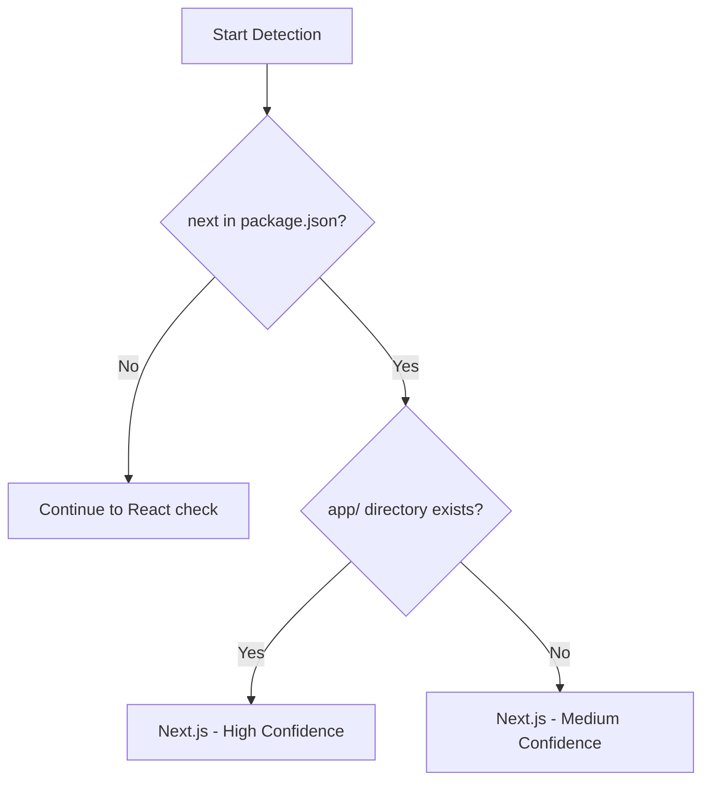

# Next.js Profile

Profile optimized for Next.js App Router projects.

## Overview

| Property | Value |
|----------|-------|
| Name | `next` |
| Detection | `next` in package.json + `app/` directory |
| Confidence | High (with app dir), Medium (next dep only) |

## Detection Logic

The profile is auto-detected when:

1. **High confidence**: `next` dependency AND `app/` or `src/app/` directory exists
2. **Medium confidence**: `next` dependency only



## Included Analyzers

| Analyzer | Purpose |
|----------|---------|
| `file-summary` | Summarize file changes |
| `file-category` | Categorize files by type |
| `next-routes` | Detect App Router changes, middleware, instrumentation, config |
| `env-var` | Detect environment variable usage |
| `cloudflare` | Detect Cloudflare config changes |
| `vitest` | Detect test file changes |
| `dependencies` | Detect dependency changes |
| `security-files` | Detect security-sensitive files |
| `impact` | Analyze blast radius of changes |
| `tailwind` | Detect Tailwind CSS config changes |
| `large-diff` | Warn about large changesets |
| `lockfiles` | Check lockfile consistency |
| `sql-risks` | Detect risky SQL in migrations |
| `ci-workflows` | Detect CI/CD changes |
| `infra` | Detect infrastructure changes |
| `api-contracts` | Detect API contract changes |

## Next.js-Specific Features

### App Router Detection

Detects changes to all App Router file conventions:

- **Pages**: `page.tsx/ts/jsx/js`
- **Layouts**: `layout.tsx/ts/jsx/js`
- **Templates**: `template.tsx/ts/jsx/js` (re-render on navigation)
- **Default**: `default.tsx/ts/jsx/js` (parallel route fallback)
- **Loading**: `loading.tsx/ts/jsx/js` (Suspense boundary)
- **Errors**: `error.tsx/ts/jsx/js`, `global-error.tsx/ts/jsx/js`, `not-found.tsx/ts/jsx/js`
- **API Routes**: `route.ts/tsx/js/jsx` with HTTP method detection

### Metadata File Conventions

Detects Next.js SEO/metadata files:

- `sitemap.ts/js`, `robots.ts/js`, `manifest.ts/js`
- `opengraph-image.*`, `twitter-image.*`, `icon.*`, `apple-icon.*`

### Middleware & Instrumentation Detection

Security-sensitive files are flagged:

- `middleware.ts` / `middleware.js` (root or `src/`)
- `instrumentation.ts` / `instrumentation.js` (root or `src/`)

### Next.js Config Detection

Config changes produce dedicated `next-config-change` findings with detected features:

- `next.config.js`, `.mjs`, `.cjs`, `.ts`
- Feature detection: rewrites, redirects, headers, images, i18n, webpack, turbopack, experimental, output, basePath, ppr, dynamicIO, etc.

### Route Groups

Route groups `(name)` are handled correctly:

```
app/(marketing)/about/page.tsx → /about
app/(auth)/login/page.tsx → /login
```

### Parallel Routes

Parallel route slots `@name` are stripped from route IDs and tracked via tags:

```
app/@modal/photo/page.tsx → /photo (tag: parallel:@modal)
```

### Intercepting Routes

Intercepting route markers are preserved in route IDs:

```
app/(.)photo/page.tsx → /(.)photo (tag: intercepting-route)
```

### Dynamic Segments

All Next.js dynamic segment patterns are supported:

- `[slug]` - Dynamic segment
- `[...slug]` - Catch-all segment
- `[[...slug]]` - Optional catch-all segment

### Server Actions & Metadata

Detects and tags special Next.js patterns:

- `"use server"` directive → `server-action` tag
- `generateStaticParams` export → `static-params` tag
- `generateMetadata` / `export const metadata` → `has-metadata` tag

## Example Output

```json
{
  "profile": {
    "requested": "auto",
    "detected": "next",
    "confidence": "high",
    "reasons": [
      "Found next in package.json dependencies",
      "Found app/ directory (Next.js App Router)"
    ]
  },
  "findings": [
    {
      "type": "route-change",
      "routeId": "/dashboard",
      "file": "app/dashboard/page.tsx",
      "change": "added",
      "routeType": "page",
      "tags": ["has-metadata"]
    },
    {
      "type": "route-change",
      "routeId": "/api/users",
      "file": "app/api/users/route.ts",
      "change": "modified",
      "routeType": "endpoint",
      "methods": ["GET", "POST"]
    },
    {
      "type": "next-config-change",
      "file": "next.config.ts",
      "status": "modified",
      "detectedFeatures": ["experimental", "ppr", "images"]
    },
    {
      "type": "security-file",
      "files": ["middleware.ts"],
      "reasons": ["middleware"]
    }
  ]
}
```

## Usage

```bash
# Auto-detect (recommended)
branch-narrator facts

# Force Next.js profile
branch-narrator facts --profile next

# Generate PR description
branch-narrator pr-body --profile next
```

## Comparison with Other Profiles

| Feature | Next.js | SvelteKit | React |
|---------|---------|-----------|-------|
| Route detection | App Router | src/routes | React Router |
| API routes | route.ts | +server.ts | N/A |
| Middleware | middleware.ts | hooks.server.ts | N/A |
| Layout system | layout.tsx | +layout.svelte | N/A |
| Template system | template.tsx | N/A | N/A |
| Parallel routes | @slot convention | N/A | N/A |
| Intercepting routes | (.) convention | N/A | N/A |
| Config detection | next.config.* | svelte.config.* | N/A |
| Server Actions | "use server" | form actions | N/A |
| Metadata files | sitemap/robots/icon | N/A | N/A |

## See Also

- [Next.js Routes Analyzer](../03-analyzers/next-routes.md)
- [Profile Overview](./overview.md)
- [SvelteKit Profile](./sveltekit.md)
