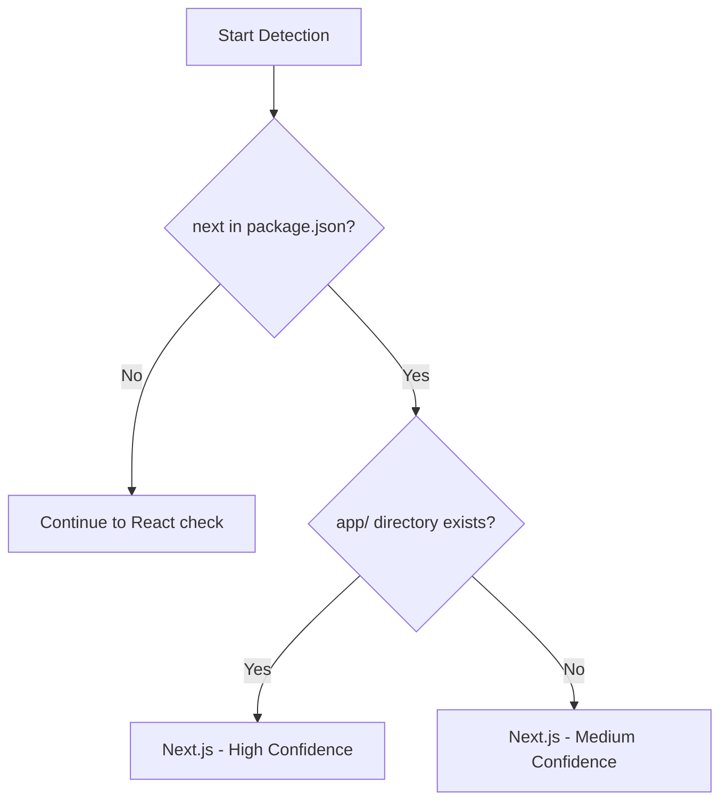

# Next.js Profile

Profile optimized for Next.js App Router projects.

## Overview

| Property | Value |
|----------|-------|
| Name | `next` |
| Detection | `next` in package.json + `app/` directory |
| Confidence | High (with app dir), Medium (next dep only) |

## Detection Logic

The profile is auto-detected when:

1. **High confidence**: `next` dependency AND `app/` or `src/app/` directory exists
2. **Medium confidence**: `next` dependency only



## Included Analyzers

| Analyzer | Purpose |
|----------|---------|
| `fileSummaryAnalyzer` | Summarize file changes |
| `fileCategoryAnalyzer` | Categorize files by type |
| `nextRoutesAnalyzer` | Detect App Router changes |
| `envVarAnalyzer` | Detect environment variable usage |
| `cloudflareAnalyzer` | Detect Cloudflare config changes |
| `vitestAnalyzer` | Detect test file changes |
| `dependencyAnalyzer` | Detect dependency changes |
| `securityFilesAnalyzer` | Detect security-sensitive files |
| `impactAnalyzer` | Analyze blast radius of changes |
| `tailwindAnalyzer` | Detect Tailwind CSS config changes |
| `analyzeLargeDiff` | Warn about large changesets |
| `analyzeLockfiles` | Check lockfile consistency |
| `analyzeTestGaps` | Detect missing test coverage |
| `analyzeSQLRisks` | Detect risky SQL in migrations |
| `analyzeCIWorkflows` | Detect CI/CD changes |
| `analyzeInfra` | Detect infrastructure changes |
| `analyzeAPIContracts` | Detect API contract changes |

## Next.js-Specific Features

### App Router Detection

Detects changes to App Router files:

- **Pages**: `page.tsx`, `page.ts`, `page.jsx`, `page.js`
- **Layouts**: `layout.tsx`, `layout.ts`
- **Loading**: `loading.tsx`, `loading.ts`
- **Errors**: `error.tsx`, `not-found.tsx`
- **API Routes**: `route.ts`, `route.tsx`

### Middleware Detection

Middleware changes are flagged as security-sensitive:

- `middleware.ts` / `middleware.js` (root)
- `src/middleware.ts` / `src/middleware.js`

### Route Groups

Route groups `(name)` are handled correctly:

```
app/(marketing)/about/page.tsx → /about
app/(auth)/login/page.tsx → /login
```

### Dynamic Segments

All Next.js dynamic segment patterns are supported:

- `[slug]` - Dynamic segment
- `[...slug]` - Catch-all segment
- `[[...slug]]` - Optional catch-all segment

## Example Output

```json
{
  "profile": {
    "requested": "auto",
    "detected": "next",
    "confidence": "high",
    "reasons": [
      "Found next in package.json dependencies",
      "Found app/ directory (Next.js App Router)"
    ]
  },
  "findings": [
    {
      "type": "route-change",
      "routeId": "/dashboard",
      "file": "app/dashboard/page.tsx",
      "change": "added",
      "routeType": "page"
    },
    {
      "type": "route-change",
      "routeId": "/api/users",
      "file": "app/api/users/route.ts",
      "change": "modified",
      "routeType": "endpoint",
      "methods": ["GET", "POST"]
    },
    {
      "type": "security-file",
      "files": ["middleware.ts"],
      "reasons": ["middleware"]
    }
  ]
}
```

## Usage

```bash
# Auto-detect (recommended)
branch-narrator facts

# Force Next.js profile
branch-narrator facts --profile next

# Generate PR description
branch-narrator pr-body --profile next
```

## Comparison with Other Profiles

| Feature | Next.js | SvelteKit | React |
|---------|---------|-----------|-------|
| Route detection | App Router | src/routes | React Router |
| API routes | route.ts | +server.ts | N/A |
| Middleware | middleware.ts | hooks.server.ts | N/A |
| Layout system | layout.tsx | +layout.svelte | N/A |

## See Also

- [Next.js Routes Analyzer](../03-analyzers/next-routes.md)
- [Profile Overview](./overview.md)
- [SvelteKit Profile](./sveltekit.md)
