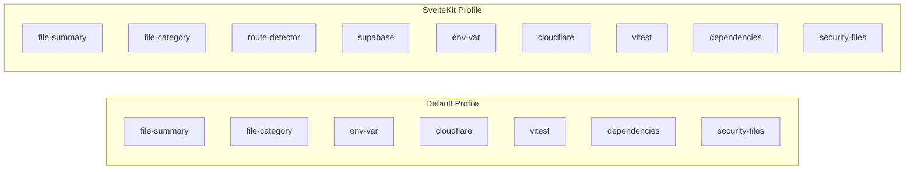

# Profiles Overview

Profiles define which analyzers run for a given project type.

## What is a Profile?

A profile is a collection of analyzers optimized for a specific framework or project type.

```typescript
interface Profile {
  name: ProfileName;
  analyzers: Analyzer[];
}
```

## Profile Resolution

```mermaid
flowchart TD
    A[CLI: --profile option] --> B{Value?}
    B -->|"auto"| C[detectProfile]
    B -->|"sveltekit"| D[Use SvelteKit]

    C --> E{src/routes exists?}
    E -->|Yes| D
    E -->|No| F{@sveltejs/kit in package.json?}
    F -->|Yes| D
    F -->|No| G[Use Default]

    D --> H[SvelteKit Analyzers]
    G --> I[Default Analyzers]
```

## Available Profiles

| Profile | Description | Detection |
|---------|-------------|-----------|
| `sveltekit` | SvelteKit fullstack apps | `src/routes/` or `@sveltejs/kit` |
| `auto` (default) | Generic projects | Fallback when no framework detected |

## Profile Comparison



**SvelteKit-specific:**
- `route-detector` - SvelteKit routes
- `supabase` - Migration analysis

## API

```typescript
// Resolve profile name (auto-detect if needed)
function resolveProfileName(
  requested: ProfileName,
  changeSet: ChangeSet,
  cwd: string
): ProfileName;

// Get profile configuration
function getProfile(name: ProfileName): Profile;

// Check for SvelteKit
function isSvelteKitProject(changeSet: ChangeSet, cwd: string): boolean;
```

## Usage

```bash
# Auto-detect profile
branch-narrator pr-body

# Force specific profile
branch-narrator pr-body --profile sveltekit
```

## Planned Profiles

| Profile | Framework | Status |
|---------|-----------|--------|
| `nextjs` | Next.js | 🔮 Planned |
| `astro` | Astro | 🔮 Planned |
| `remix` | Remix | 🔮 Planned |

