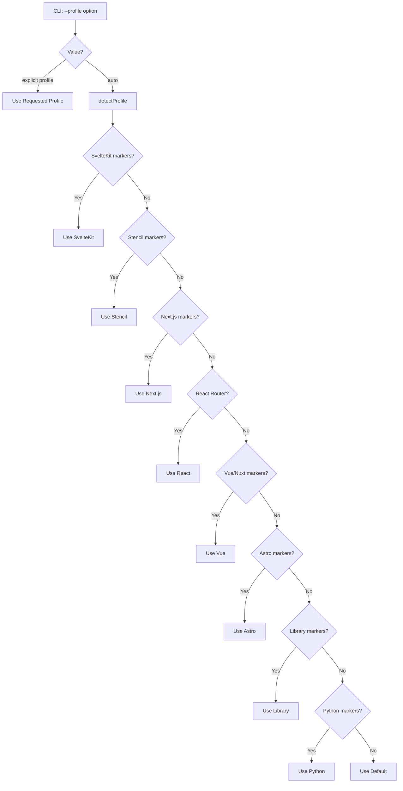

# Profiles Overview

Profiles define which analyzers run for a given project type.

## What is a Profile?

A profile is a collection of analyzers optimized for a specific framework or project type.

```typescript
interface Profile {
  name: ProfileName;
  analyzers: Analyzer[];
}
```

## Profile Resolution



## Available Profiles

| Profile | Description | Detection |
|---------|-------------|-----------|
| `sveltekit` | SvelteKit fullstack apps | `src/routes/` or `@sveltejs/kit` |
| `stencil` | Stencil web components | `@stencil/core` or `stencil.config.ts` |
| `next` | Next.js App Router apps | `next` dependency + `app/` directory |
| `react` | React + React Router apps | `react` + `react-router-dom` |
| `vue` | Vue.js + Nuxt apps | `vue` or `nuxt` + `pages/` directory |
| `astro` | Astro static sites | `astro` dependency or `astro.config.*` |
| `library` | npm packages/libraries | `exports`, `publishConfig`, or `bin` in package.json |
| `python` | Python projects | `pyproject.toml`, `requirements.txt`, Django/FastAPI markers |
| `auto` (default) | Generic projects | Fallback when no framework detected |

## Profile Comparison

All profiles share a common set of core analyzers for comprehensive coverage:

### Core Analyzers (All Profiles)

| Analyzer | Purpose |
|----------|---------|
| `file-summary` | Summarize file changes |
| `file-category` | Categorize files by type |
| `dependencies` | Analyze package.json |

### Frontend Profile Analyzers

These analyzers are included in all frontend profiles (SvelteKit, Next.js, React, Vue, Astro, Stencil):

| Analyzer | Purpose |
|----------|---------|
| `env-var` | Extract environment variables |
| `cloudflare` | Detect Cloudflare changes |
| `vitest` | Detect test changes |
| `security-files` | Detect security-sensitive files |
| `impact` | Analyze blast radius of changes |
| `large-diff` | Detect large changesets |
| `lockfiles` | Detect lockfile/manifest mismatches |
| `sql-risks` | Detect risky SQL in migrations |
| `ci-workflows` | Detect CI/CD changes |
| `infra` | Detect infrastructure changes |
| `api-contracts` | Detect API contract changes |

### Framework-Specific Analyzers

**Default profile:**
- `graphql` - Detect GraphQL schema changes (auto-detects .graphql/.gql files)

**SvelteKit-specific:**
- `route-detector` - SvelteKit file-based routes
- `supabase` - Migration analysis
- `tailwind` - Tailwind CSS config changes

**Next.js-specific:**
- `next-routes` - App Router route detection (pages, layouts, API routes, middleware)
- `tailwind` - Tailwind CSS config changes

**React-specific:**
- `react-router-routes` - React Router route detection
- `tailwind` - Tailwind CSS config changes
- `typescript-config` - TypeScript config changes

**Stencil-specific:**
- `stencil` - Web component analysis (props, events, methods, slots)
- `typescript-config` - TypeScript config changes

## API

```typescript
// Detect profile with detailed reasons
interface ProfileDetectionResult {
  profile: ProfileName;
  confidence: "high" | "medium" | "low";
  reasons: string[];
}

function detectProfileWithReasons(
  changeSet: ChangeSet,
  cwd: string
): ProfileDetectionResult;

// Resolve profile name (auto-detect if needed)
function resolveProfileName(
  requested: ProfileName,
  changeSet: ChangeSet,
  cwd: string
): ProfileName;

// Get profile configuration
function getProfile(name: ProfileName): Profile;

// Check for SvelteKit
function isSvelteKitProject(changeSet: ChangeSet, cwd: string): boolean;
```

## Detection Reasons

When a profile is auto-detected, the `facts` command includes detailed reasons explaining **why** the profile was chosen:

| Profile | Example Reasons |
|---------|-----------------|
| `sveltekit` | "Found src/routes/ directory (SvelteKit file-based routing)", "Found @sveltejs/kit in package.json dependencies" |
| `stencil` | "Found @stencil/core in package.json dependencies", "Found stencil.config.ts or stencil.config.js" |
| `next` | "Found next in package.json dependencies", "Found app/ directory (Next.js App Router)" |
| `react` | "Found react and react-dom in package.json dependencies", "Found react-router or react-router-dom in package.json dependencies" |
| `vue` | "Found vue in package.json dependencies", "Found pages/ directory (Nuxt file-based routing)" |
| `astro` | "Found astro in package.json dependencies", "Found astro.config.{mjs,ts,js}" |
| `library` | "Found exports field in package.json", "Found bin field in package.json (CLI tool)", "Package marked as public (private: false)" |
| `python` | "Found Python project files (pyproject.toml, requirements.txt, etc.)", "Found Python web framework markers (manage.py, main.py, etc.)" |
| `auto` | "No framework-specific markers detected, using default analyzers" |

Example output:
```json
{
  "profile": {
    "requested": "auto",
    "detected": "sveltekit",
    "confidence": "high",
    "reasons": [
      "Found src/routes/ directory (SvelteKit file-based routing)",
      "Found @sveltejs/kit in package.json dependencies"
    ]
  }
}
```

## Usage

```bash
# Auto-detect profile
branch-narrator pr-body

# Force specific profile
branch-narrator pr-body --profile sveltekit
```

## Analyzer Coverage Matrix

| Analyzer | default | sveltekit | next | react | vue | astro | stencil | library |
|----------|---------|-----------|------|-------|-----|-------|---------|---------|
| file-summary | ✅ | ✅ | ✅ | ✅ | ✅ | ✅ | ✅ | ✅ |
| file-category | ✅ | ✅ | ✅ | ✅ | ✅ | ✅ | ✅ | ✅ |
| dependencies | ✅ | ✅ | ✅ | ✅ | ✅ | ✅ | ✅ | ✅ |
| env-var | ✅ | ✅ | ✅ | ✅ | ✅ | ✅ | ✅ | - |
| cloudflare | ✅ | ✅ | ✅ | ✅ | ✅ | ✅ | ✅ | - |
| vitest | ✅ | ✅ | ✅ | ✅ | ✅ | ✅ | ✅ | ✅ |
| security-files | ✅ | ✅ | ✅ | ✅ | ✅ | ✅ | ✅ | - |
| impact | ✅ | ✅ | ✅ | ✅ | ✅ | ✅ | ✅ | ✅ |
| large-diff | ✅ | ✅ | ✅ | ✅ | ✅ | ✅ | ✅ | ✅ |
| lockfiles | ✅ | ✅ | ✅ | ✅ | ✅ | ✅ | ✅ | ✅ |
| sql-risks | ✅ | ✅ | ✅ | ✅ | ✅ | ✅ | ✅ | - |
| ci-workflows | ✅ | ✅ | ✅ | ✅ | ✅ | ✅ | ✅ | ✅ |
| infra | ✅ | ✅ | ✅ | ✅ | ✅ | ✅ | ✅ | - |
| api-contracts | ✅ | ✅ | ✅ | ✅ | ✅ | ✅ | ✅ | ✅ |
| graphql | ✅ | - | - | - | - | - | - | - |
| tailwind | - | ✅ | ✅ | ✅ | ✅ | ✅ | - | - |
| typescript-config | - | - | - | ✅ | ✅ | ✅ | ✅ | ✅ |

## Planned Profiles

| Profile | Framework | Status |
|---------|-----------|--------|
| `remix` | Remix | 🔮 Planned |

