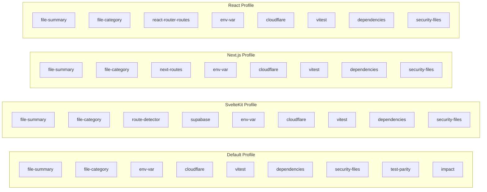

# Profiles Overview

Profiles define which analyzers run for a given project type.

## What is a Profile?

A profile is a collection of analyzers optimized for a specific framework or project type.

```typescript
interface Profile {
  name: ProfileName;
  analyzers: Analyzer[];
}
```

## Profile Resolution

```mermaid
flowchart TD
    A[CLI: --profile option] --> B{Value?}
    B -->|"auto"| C[detectProfile]
    B -->|"sveltekit"| D[Use SvelteKit]
    B -->|"next"| N[Use Next.js]

    C --> E{src/routes exists?}
    E -->|Yes| D
    E -->|No| F{@sveltejs/kit in package.json?}
    F -->|Yes| D
    F -->|No| S{@stencil/core?}
    S -->|Yes| T[Use Stencil]
    S -->|No| J{next in package.json?}
    J -->|Yes| N
    J -->|No| K{react + react-router-dom?}
    K -->|Yes| L[Use React]
    K -->|No| G[Use Default]

    D --> H[SvelteKit Analyzers]
    N --> O[Next.js Analyzers]
    T --> U[Stencil Analyzers]
    L --> M[React Analyzers]
    G --> I[Default Analyzers]
```

## Available Profiles

| Profile | Description | Detection |
|---------|-------------|-----------|
| `sveltekit` | SvelteKit fullstack apps | `src/routes/` or `@sveltejs/kit` |
| `stencil` | Stencil web components | `@stencil/core` or `stencil.config.ts` |
| `next` | Next.js App Router apps | `next` dependency + `app/` directory |
| `react` | React + React Router apps | `react` + `react-router-dom` |
| `auto` (default) | Generic projects | Fallback when no framework detected |

## Profile Comparison



**Default-specific:**
- `test-parity` - Convention enforcement for test coverage
- `impact` - Blast radius analysis for modified files

**SvelteKit-specific:**
- `route-detector` - SvelteKit routes
- `supabase` - Migration analysis

**Next.js-specific:**
- `next-routes` - App Router route detection (pages, layouts, API routes, middleware)

**React-specific:**
- `react-router-routes` - React Router route detection

## API

```typescript
// Detect profile with detailed reasons
interface ProfileDetectionResult {
  profile: ProfileName;
  confidence: "high" | "medium" | "low";
  reasons: string[];
}

function detectProfileWithReasons(
  changeSet: ChangeSet,
  cwd: string
): ProfileDetectionResult;

// Resolve profile name (auto-detect if needed)
function resolveProfileName(
  requested: ProfileName,
  changeSet: ChangeSet,
  cwd: string
): ProfileName;

// Get profile configuration
function getProfile(name: ProfileName): Profile;

// Check for SvelteKit
function isSvelteKitProject(changeSet: ChangeSet, cwd: string): boolean;
```

## Detection Reasons

When a profile is auto-detected, the `facts` command includes detailed reasons explaining **why** the profile was chosen:

| Profile | Example Reasons |
|---------|-----------------|
| `sveltekit` | "Found src/routes/ directory (SvelteKit file-based routing)", "Found @sveltejs/kit in package.json dependencies" |
| `stencil` | "Found @stencil/core in package.json dependencies", "Found stencil.config.ts or stencil.config.js" |
| `next` | "Found next in package.json dependencies", "Found app/ directory (Next.js App Router)" |
| `react` | "Found react and react-dom in package.json dependencies", "Found react-router or react-router-dom in package.json dependencies" |
| `auto` | "No framework-specific markers detected, using default analyzers" |

Example output:
```json
{
  "profile": {
    "requested": "auto",
    "detected": "sveltekit",
    "confidence": "high",
    "reasons": [
      "Found src/routes/ directory (SvelteKit file-based routing)",
      "Found @sveltejs/kit in package.json dependencies"
    ]
  }
}
```

## Usage

```bash
# Auto-detect profile
branch-narrator pr-body

# Force specific profile
branch-narrator pr-body --profile sveltekit
```

## Planned Profiles

| Profile | Framework | Status |
|---------|-----------|--------|
| `astro` | Astro | 🔮 Planned |
| `remix` | Remix | 🔮 Planned |

