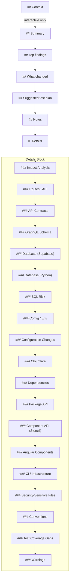

# Markdown Rendering

The Markdown renderer generates human-readable PR descriptions.

## Entry Point

```typescript
function renderMarkdown(context: RenderContext): string;
```

## Structure Overview

The output is organized into compact primary sections with extended information in a collapsible `<details>` block:



## Primary Sections

### Context (Interactive Only)

Only rendered when `--interactive` flag is used.

```markdown
## Context

This PR implements user authentication using Supabase Auth.
```

### Summary

Compact summary with diffstat and key highlights.

```markdown
## Summary

- Files: 14 changed (4 added, 9 modified, 1 deleted)
- Review attention: HIGH (blast radius)
- High blast radius: src/lib/db.ts (15 dependents)
- 2 new routes
- Changeset added
```

### Top findings

Prioritized list of significant findings (max 5 items) with examples.

```markdown
## Top findings

1) High blast radius: src/lib/db.ts (15 dependents)
   `src/routes/api/users/+server.ts`, `src/lib/auth.ts` (+13 more)

2) Security-sensitive files changed (2 files)
   `src/lib/auth.ts`, `src/lib/session.ts`

3) Major dependency updates (2 packages)
   `@sveltejs/kit`, `vitest`
```

### What changed

Files grouped by category with Primary files for small changes and Changesets separated from Documentation.

```markdown
## What changed

### Primary files

- `src/lib/auth.ts` (modified)

### Product Code (9)

- `src/lib/auth.ts`
- `src/routes/login/+page.svelte` *(new)*
- `src/routes/logout/+server.ts` *(new)*

### Tests (4)

- `tests/auth.test.ts` *(new)*
- `tests/login.test.ts`

### Changesets (1)

- `.changeset/brave-tigers-fly.md` *(new)*
```

### Suggested test plan

Profile-specific commands with rationales.

```markdown
## Suggested test plan

- [ ] `bun test` (4 test files changed)
- [ ] `bun run check` (SvelteKit profile)
- [ ] `Test GET /api/users endpoint` (route changed)
- [ ] `Verify /login page renders correctly` (page changed)
```

### Notes

Risk level and evidence bullets.

```markdown
## Notes

- Risk: LOW (15/100)
- No elevated risks detected.
```

Or with evidence:

```markdown
## Notes

- Risk: MEDIUM (45/100)
- Major version bump: @sveltejs/kit ^1.0.0 → ^2.0.0
- Security-sensitive files changed: 2 file(s)
- New env var: PUBLIC_API_URL
```

## Details Block

Extended information is placed in a collapsible `<details>` block.

### Impact Analysis

Files with high/medium blast radius and their dependents.

```markdown
### Impact Analysis

**`src/lib/db.ts`** - Blast Radius: HIGH (15 files)

Affected files:
- `src/routes/api/users/+server.ts`
- `src/routes/api/posts/+server.ts`
- `src/lib/auth.ts`
- `src/lib/cache.ts`
- `src/lib/session.ts`
- ...and 10 more
```

### Routes / API

Table of route changes.

```markdown
### Routes / API

| Route | Type | Change | Methods |
|-------|------|--------|---------|
| `/login` | page | added | - |
| `/api/users` | endpoint | added | GET, POST |
```

### API Contracts

Lists changed API specification files.

```markdown
### API Contracts

The following API specification files have changed:

- `openapi.yaml`
- `swagger.json`
```

### GraphQL Schema

Shows GraphQL schema changes with breaking change detection.

```markdown
### GraphQL Schema

**Breaking Changes**

**File:** `schema.graphql`
- Removed field `User.email`
- Changed type of `Query.users`

**Added Elements**

**File:** `schema.graphql`
- Added type `Organization`
- Added field `User.organization`

**All Schema Changes**

| File | Status | Breaking |
|------|--------|----------|
| `schema.graphql` | modified | Yes |
```

### Database (Supabase)

Migration files with risk assessment.

```markdown
### Database (Supabase)

**Risk Level:** HIGH

**Files:**
- `supabase/migrations/20240101_add_users.sql`

**Detected patterns:**
- DROP TABLE detected
```

### Database (Python)

Python migration files (Django/Alembic) with risk assessment.

```markdown
### Database (Python)

**Tool:** Alembic
**Risk Level:** MEDIUM

**Files:**
- `alembic/versions/20240101_add_users.py`

**Detected patterns:**
- drop_column detected
```

### SQL Risk

SQL files with risky operations.

```markdown
### SQL Risk

**destructive**
- File: `migrations/drop_users.sql`
- Contains DROP TABLE statement

**schema change**
- File: `migrations/alter_table.sql`
- ALTER TABLE with column removal
```

### Config / Env

Environment variable changes.

```markdown
### Config / Env

| Variable | Status | Evidence |
|----------|--------|----------|
| `PUBLIC_API_URL` | added | src/lib/config.ts |
```

### Configuration Changes

TypeScript, Tailwind, Vite, and monorepo configuration changes. Python configuration
changes are rendered in a separate **Python Configuration** section.

```markdown
### Configuration Changes

**TypeScript Configuration**

**File:** `tsconfig.json` (BREAKING)

Strictness Changes:
- Disabled `strict` mode

**Modified:** `target`, `module`

**Tailwind Configuration**

**File:** `tailwind.config.js` (tailwind)

Affected Sections:
- theme.colors
- plugins

**Monorepo Configuration**

**Tool:** turborepo
**File:** `turbo.json`

Changed Fields:
- pipeline.build
- pipeline.test

Impacts:
- Build order may change
```

### Python Configuration

```markdown
### Python Configuration

**File:** `pyproject.toml` (linting)

Affected Sections:
- tool.ruff
- tool.pytest
```

### Cloudflare

Cloudflare-related changes.

```markdown
### Cloudflare

**Area:** wrangler
**Files:**
- `wrangler.toml`
```

### Dependencies

Package.json changes.

```markdown
### Dependencies

**Production**

| Package | From | To | Impact |
|---------|------|-----|--------|
| `@sveltejs/kit` | ^1.0.0 | ^2.0.0 | major |

**Dev Dependencies**

| Package | From | To | Impact |
|---------|------|-----|--------|
| `vitest` | ^0.28.0 | ^1.0.0 | major |
```

### Package API

Changes to package exports and entry points.

```markdown
### Package API

**Status:** Breaking

**Removed Exports**

- `./utils`
- `./legacy`

**Added Exports**

- `./client`
- `./server`

**Entry Point Changes**

| Field | From | To |
|-------|------|-----|
| `main` | dist/index.js | dist/cjs/index.js |

**Binary Commands**

**Added:** `my-cli`
**Removed:** `old-cli`
```

### Component API (Stencil)

Stencil web component API changes grouped by component tag.

```markdown
### Component API (Stencil)

**`<my-button>`**

**Component:** tag-changed (button → my-button)
**File:** `src/components/button.tsx`

**Props:**
- `variant`: string (added)
- `type`: string (removed)
- `size`: string (changed)

**Events:**
- `buttonClick` (added)

**Methods:**
- `focus(): void` (added)

**Slots:**
- (default) (added)
- "icon" (added)
```

### Angular Components

Angular component and module changes grouped by type.

```markdown
### Angular Components

**Components**

| File | Change | Selector | Standalone |
|------|--------|----------|------------|
| `src/app/button.component.ts` | added | `app-button` | Yes |

**Services**

| File | Change | Selector | Standalone |
|------|--------|----------|------------|
| `src/app/auth.service.ts` | modified | - | - |
```

### CI / Infrastructure

CI workflow and infrastructure changes.

```markdown
### CI Workflows

**permissions broadened**
- File: `.github/workflows/ci.yml`
- Added write permissions to workflow

**pipeline changed**
- File: `.github/workflows/deploy.yml`
- Modified deployment steps

### Infrastructure

**Docker:**
- `Dockerfile`
- `docker-compose.yml`

**Kubernetes:**
- `k8s/deployment.yaml`
```

### Security-Sensitive Files

Files touching authentication, authorization, or security-critical code.

```markdown
### Security-Sensitive Files

The following files touch authentication, authorization, or security-critical code:

- `src/lib/auth.ts` *(authentication)*
- `src/lib/session.ts` *(session management)*
- `src/middleware/guard.ts` *(authorization)*
```

### Conventions

Convention violations detected.

```markdown
### Conventions

- **Test files should use .test.ts extension**
  - `src/utils.spec.ts`
  - `src/helpers.spec.ts`
```

### Test Coverage Gaps

Source files without corresponding tests.

```markdown
### Test Coverage Gaps

Found 3 source file(s) without corresponding tests:

- [high] `src/lib/auth.ts`
- [medium] `src/utils/helpers.ts`
- [low] `src/config.ts`
```

### Warnings

Warnings about changeset characteristics.

```markdown
### Warnings

- **Large diff detected:** 50 files changed, 2500 lines modified
- **Lockfile mismatch:** package.json changed but lockfile not updated
- **Test coverage gap:** 10 production files changed, only 2 test files changed
```

## Empty Section Handling

Sections with no content are automatically omitted. The `<details>` block is only rendered if there is extended content to show.

## No Emojis

The markdown output is emoji-free for clean, professional PR descriptions.
