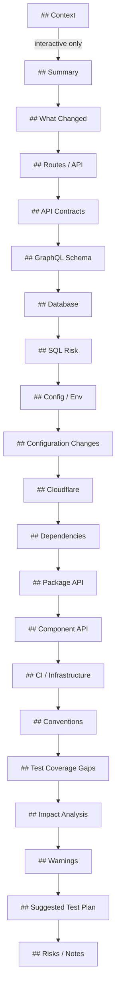

# Markdown Rendering

The Markdown renderer generates human-readable PR descriptions.

## Entry Point

```typescript
function renderMarkdown(context: RenderContext): string;
```

## Sections

The output includes these sections in order:



## Section Details

### Context (Interactive Only)

Only rendered when `--interactive` flag is used.

```markdown
## Context

This PR implements user authentication using Supabase Auth.
```

### Summary

2-6 bullets derived from top findings. Includes counts for:
- Files changed/added/deleted
- New routes
- Database migrations
- Major dependency updates
- Security-sensitive files
- GraphQL breaking changes
- CI workflow changes
- Component API changes
- Package API breaking changes

```markdown
## Summary

- 14 file(s) changed
- 4 file(s) added
- 2 new route(s)
- Database migrations detected
- 1 major dependency update(s)
- 2 security-sensitive file(s) changed
```

### What Changed

Files grouped by category.

```markdown
## What Changed

### Product Code (9)

- `src/lib/auth.ts`
- `src/routes/login/+page.svelte` *(new)*
- `src/routes/logout/+server.ts` *(new)*

### Tests (4)

- `tests/auth.test.ts` *(new)*
- `tests/login.test.ts`
```

### Routes / API

Table of SvelteKit route changes.

```markdown
## Routes / API

| Route | Type | Change | Methods |
|-------|------|--------|---------|
| `/login` | page | added | - |
| `/api/users` | endpoint | added | GET, POST |
```

### API Contracts

Lists changed API specification files (OpenAPI, Swagger, etc.).

```markdown
## API Contracts

The following API specification files have changed:

- `openapi.yaml`
- `swagger.json`
```

### GraphQL Schema

Shows GraphQL schema changes with breaking change detection.

```markdown
## GraphQL Schema

### 🔴 Breaking Changes

**File:** `schema.graphql`
- Removed field `User.email`
- Changed type of `Query.users`

### Added Elements

**File:** `schema.graphql`
- Added type `Organization`
- Added field `User.organization`

### All Schema Changes

| File | Status | Breaking |
|------|--------|----------|
| `schema.graphql` | modified | 🔴 Yes |
```

### Database (Supabase)

Migration files with risk assessment.

```markdown
## Database (Supabase)

**Risk Level:** 🔴 HIGH

**Files:**
- `supabase/migrations/20240101_add_users.sql`

**Detected patterns:**
- DROP TABLE detected
```

### SQL Risk

SQL files with risky operations.

```markdown
## SQL Risk

🔴 **destructive**
- File: `migrations/drop_users.sql`
- Contains DROP TABLE statement

🟡 **schema change**
- File: `migrations/alter_table.sql`
- ALTER TABLE with column removal
```

### Config / Env

Environment variable changes.

```markdown
## Config / Env

| Variable | Status | Evidence |
|----------|--------|----------|
| `PUBLIC_API_URL` | added | src/lib/config.ts |
```

### Configuration Changes

TypeScript, Tailwind, and monorepo configuration changes.

```markdown
## Configuration Changes

### TypeScript Configuration

**File:** `tsconfig.json` 🔴

**Strictness Changes:**
- Disabled `strict` mode

**Modified:** `target`, `module`

### Tailwind Configuration

**File:** `tailwind.config.js` (tailwind) 🟢

**Affected Sections:**
- theme.colors
- plugins

### Monorepo Configuration

**Tool:** turborepo
**File:** `turbo.json`

**Changed Fields:**
- pipeline.build
- pipeline.test

**Impacts:**
- Build order may change
```

### Cloudflare

Cloudflare-related changes.

```markdown
## Cloudflare

**Area:** wrangler
**Files:**
- `wrangler.toml`
```

### Dependencies

Package.json changes.

```markdown
## Dependencies

### Production

| Package | From | To | Impact |
|---------|------|-----|--------|
| `@sveltejs/kit` | ^1.0.0 | ^2.0.0 | major |

### Dev Dependencies

| Package | From | To | Impact |
|---------|------|-----|--------|
| `vitest` | ^0.28.0 | ^1.0.0 | major |
```

### Package API

Changes to package exports and entry points.

```markdown
## Package API

**Status:** 🔴 Breaking

### Removed Exports

- 🔴 `./utils`
- 🔴 `./legacy`

### Added Exports

- 🟢 `./client`
- 🟢 `./server`

### Entry Point Changes

| Field | From | To |
|-------|------|-----|
| `main` | dist/index.js | dist/cjs/index.js |

### Binary Commands

**Added:** `my-cli`
**Removed:** `old-cli`
```

### Component API (Stencil)

Stencil web component API changes grouped by component tag.

```markdown
## Component API (Stencil)

### `<my-button>`

**Component:** 🟡 tag-changed (button → my-button)
**File:** `src/components/button.tsx`

**Props:**
- 🟢 `variant`: string (added)
- 🔴 `type`: string (removed)
- 🟡 `size`: string (changed)

**Events:**
- 🟢 `buttonClick` (added)

**Methods:**
- 🟢 `focus(): void` (added)

**Slots:**
- 🟢 (default) (added)
- 🟢 "icon" (added)
```

### CI / Infrastructure

CI workflow and infrastructure changes.

```markdown
## CI / Infrastructure

### CI Workflows

🔴 **permissions broadened**
- File: `.github/workflows/ci.yml`
- Added write permissions to workflow

🟡 **pipeline changed**
- File: `.github/workflows/deploy.yml`
- Modified deployment steps

### Infrastructure

**Docker:**
- `Dockerfile`
- `docker-compose.yml`

**Kubernetes:**
- `k8s/deployment.yaml`
```

### Conventions

Convention violations detected.

```markdown
## ⚠️ Conventions

- **Test files should use .test.ts extension**
  - `src/utils.spec.ts`
  - `src/helpers.spec.ts`
```

### Test Coverage Gaps

Source files without corresponding tests.

```markdown
## 🧪 Test Coverage Gaps

Found 3 source file(s) without corresponding tests:

- 🔴 `src/lib/auth.ts`
- 🟡 `src/utils/helpers.ts`
- ⚪ `src/config.ts`
```

### Impact Analysis

Files with high blast radius.

```markdown
## 🧨 Impact Analysis

### `src/lib/db.ts` 🔴

**Blast Radius:** HIGH (15 files)

Affected files:
- `src/routes/api/users/+server.ts`
- `src/routes/api/posts/+server.ts`
- `src/lib/auth.ts`
- `src/lib/cache.ts`
- `src/lib/session.ts`
- ...and 10 more
```

### Warnings

Warnings about changeset characteristics.

```markdown
## ⚠️ Warnings

- **Large diff detected:** 50 files changed, 2500 lines modified
- **Lockfile mismatch:** package.json changed but lockfile not updated
- **Test coverage gap:** 10 production files changed, only 2 test files changed
```

### Suggested Test Plan

Actionable checklist.

```markdown
## Suggested Test Plan

- [ ] `bun run test` - Run test suite
- [ ] `bun run check` - Run SvelteKit type check
- [ ] Test `GET/POST /api/users` endpoint
- [ ] Verify `/login` page renders correctly
```

### Risks / Notes

Risk score with evidence.

```markdown
## Risks / Notes

**Overall Risk:** 🟡 MEDIUM (score: 45/100)

- ⚠️ Major version bump: @sveltejs/kit ^1.0.0 → ^2.0.0
- ⚡ Security-sensitive files changed (Authentication): 2 file(s)
- ℹ️ New env var: PUBLIC_API_URL
```

## Empty Section Handling

Sections with no content are automatically omitted.

## Risk Emojis

| Level | Emoji |
|-------|-------|
| High | 🔴 |
| Medium | 🟡 |
| Low | 🟢 |

## Evidence Emojis

| Level | Emoji |
|-------|-------|
| High risk | ⚠️ |
| Medium risk | ⚡ |
| Low risk / Info | ℹ️ |
| Reduction | ✅ |

## Change Status Emojis

| Status | Emoji |
|--------|-------|
| Added | 🟢 |
| Removed | 🔴 |
| Changed | 🟡 |
