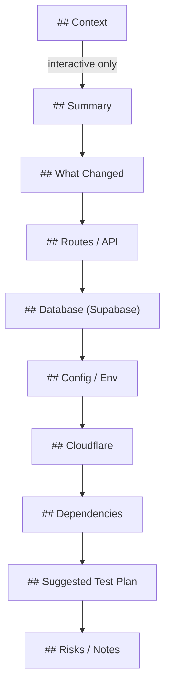

# Markdown Rendering

The Markdown renderer generates human-readable PR descriptions.

## Entry Point

```typescript
function renderMarkdown(context: RenderContext): string;
```

## Sections

The output includes these sections in order:



## Section Details

### Context (Interactive Only)

Only rendered when `--interactive` flag is used.

```markdown
## Context

This PR implements user authentication using Supabase Auth.
```

### Summary

2-6 bullets derived from top findings.

```markdown
## Summary

- 14 file(s) changed
- 4 file(s) added
- 2 new route(s)
- Database migrations detected
- 1 major dependency update(s)
- 2 security-sensitive file(s) changed
```

### What Changed

Files grouped by category.

```markdown
## What Changed

### Product Code (9)

- `src/lib/auth.ts`
- `src/routes/login/+page.svelte` *(new)*
- `src/routes/logout/+server.ts` *(new)*

### Tests (4)

- `tests/auth.test.ts` *(new)*
- `tests/login.test.ts`
```

### Routes / API

Table of SvelteKit route changes.

```markdown
## Routes / API

| Route | Type | Change | Methods |
|-------|------|--------|---------|
| `/login` | page | added | - |
| `/api/users` | endpoint | added | GET, POST |
```

### Database (Supabase)

Migration files with risk assessment.

```markdown
## Database (Supabase)

**Risk Level:** 🔴 HIGH

**Files:**
- `supabase/migrations/20240101_add_users.sql`

**Detected patterns:**
- DROP TABLE detected
```

### Config / Env

Environment variable changes.

```markdown
## Config / Env

| Variable | Status | Evidence |
|----------|--------|----------|
| `PUBLIC_API_URL` | added | src/lib/config.ts |
```

### Cloudflare

Cloudflare-related changes.

```markdown
## Cloudflare

**Area:** wrangler
**Files:**
- `wrangler.toml`
```

### Dependencies

Package.json changes.

```markdown
## Dependencies

### Production

| Package | From | To | Impact |
|---------|------|-----|--------|
| `@sveltejs/kit` | ^1.0.0 | ^2.0.0 | major |

### Dev Dependencies

| Package | From | To | Impact |
|---------|------|-----|--------|
| `vitest` | ^0.28.0 | ^1.0.0 | major |
```

### Suggested Test Plan

Actionable checklist.

```markdown
## Suggested Test Plan

- [ ] `bun test` - Run test suite
- [ ] `bun run check` - Run SvelteKit type check
- [ ] Test `GET/POST /api/users` endpoint
- [ ] Verify `/login` page renders correctly
```

### Risks / Notes

Risk score with evidence.

```markdown
## Risks / Notes

**Overall Risk:** 🟡 MEDIUM (score: 45/100)

- ⚠️ Major version bump: @sveltejs/kit ^1.0.0 → ^2.0.0
- ⚡ Security-sensitive files changed (Authentication): 2 file(s)
- ℹ️ New env var: PUBLIC_API_URL
```

## Empty Section Handling

Sections with no content are automatically omitted.

## Risk Emojis

| Level | Emoji |
|-------|-------|
| High | 🔴 |
| Medium | 🟡 |
| Low | 🟢 |

## Evidence Emojis

| Level | Emoji |
|-------|-------|
| High risk | ⚠️ |
| Medium risk | ⚡ |
| Low risk / Info | ℹ️ |
| Reduction | ✅ |

