# Risk Scoring

Risk score computation with evidence-based explanations.

## Entry Point

```typescript
function computeRiskScore(findings: Finding[]): RiskScore;
```

## Output

```typescript
interface RiskScore {
  score: number;           // 0-100
  level: RiskLevel;        // "low" | "medium" | "high"
  evidenceBullets: string[];
}
```

## Score Thresholds

```mermaid
graph LR
    A["Score: 0-19"] --> B["Level: LOW 🟢"]
    C["Score: 20-49"] --> D["Level: MEDIUM 🟡"]
    E["Score: 50-100"] --> F["Level: HIGH 🔴"]
```



## Scoring Rules

### Positive Points (Increase Risk)

| Finding Type | Condition | Points |
|-------------|-----------|--------|
| `risk-flag` | risk = "high" | +40 |
| `risk-flag` | risk = "medium" | +20 |
| `risk-flag` | risk = "low" | +5 |
| `db-migration` | risk = "high" | +30 |
| `db-migration` | risk = "medium" | +15 |
| `route-change` | change = "added" | +5 |
| `route-change` | change = "deleted" | +10 |
| `dependency-change` | impact = "major" | +15 |
| `dependency-change` | impact = "minor" | +5 |
| `dependency-change` | riskCategory + new | +10 |
| `env-var` | change = "added" | +5 |
| `security-file` | any | +15 |

### Negative Points (Reduce Risk)

| Condition | Points |
|-----------|--------|
| Only docs changed | -15 |
| Only tests changed | -10 |
| Only config changed | -5 |
| Only docs/tests/config changed | -10 |

## Evidence Bullets

Each scoring action adds an evidence bullet:

| Emoji | Meaning | Example |
|-------|---------|---------|
| ⚠️ | High-risk item | `⚠️ Major version bump: @sveltejs/kit ^1.0.0 → ^2.0.0` |
| ⚡ | Medium-risk item | `⚡ Security-sensitive files changed (Authentication): 2 file(s)` |
| ℹ️ | Low-risk / Info | `ℹ️ New env var: PUBLIC_API_URL` |
| ✅ | Risk reduction | `✅ Changes are only in docs (lower risk)` |

## Low-Risk Detection


**High-risk categories:** product, infra, ci, dependencies
**Low-risk categories:** docs, tests, config

## Example Calculation

```
Findings:
- risk-flag (high): Major version bump      +40
- security-file: 2 auth files               +15
- risk-flag (medium): Security files        +20
- env-var (added): PUBLIC_API_URL           +5
- dependency-change (major): @sveltejs/kit  +15
                                           ----
                                    Total:  95

Capped at 100.
Level: HIGH
```

## Score Bounds

- Minimum: 0 (floor applied)
- Maximum: 100 (ceiling applied)

```typescript
score = Math.max(0, Math.min(score, 100));
```

## Rendered Output

```markdown
## Risks / Notes

**Overall Risk:** 🟡 MEDIUM (score: 45/100)

- ⚠️ Major version bump: @sveltejs/kit ^1.0.0 → ^2.0.0
- ⚡ Security-sensitive files changed (Authentication): 2 file(s)
- ℹ️ New env var: PUBLIC_API_URL
```

